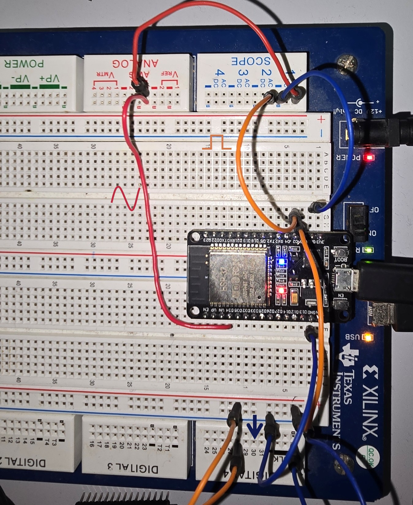
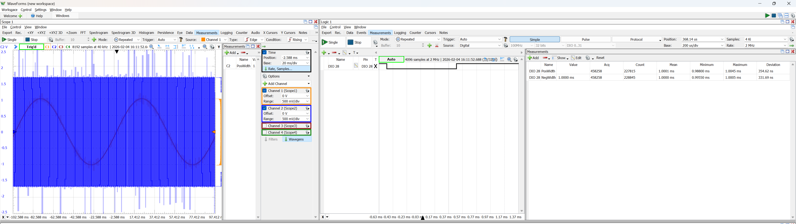
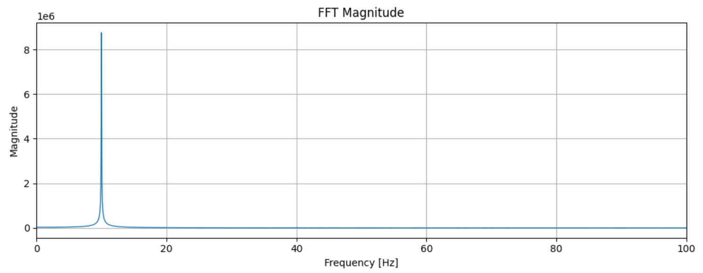

# Sensor Intelligence Lab
**Author:** Fausto Orozco Coy, MSc.  
**Status:** 🚀 Active Development - Week 1: High-Fidelity Signal Acquisition.

## 🎯 Project Scope
This project implements a deterministic signal acquisition pipeline using an ESP32. The goal is to move away from non-deterministic `delay()` based loops towards hardware-timed sampling, suitable for high-fidelity DSP and TinyML applications.

### 🛠 Tech Stack
- **Firmware:** C++ (ESP-IDF/Arduino Framework), Hardware Timers, ISR (Interrupt Service Routines).
- **Tooling:** PlatformIO, Python 3.12 (Pandas, Matplotlib, SciPy).
- **Instrumentation:** Digilent Analog Discovery (Explorer) for Signal Generation and Logic Analysis.

## 🏗 System Architecture
1. **Hardware Timer:** Configured at 1MHz tick rate.
2. **ISR:** Discharged every 1,000 ticks (1kHz sampling). Includes a toggle pin for latency profiling.
3. **Serial Bridge:** 921,600 baud rate transmission in raw CSV format.
4. **Python Pipeline:** Real-time data logging and spectral analysis.

## 📸 Hardware Setup

*Figure 1: ESP32 connected to Digilent Analog Discovery for Sine wave generation and Logic Profiling.*

## 📊 Validation & Metrics (The "Proof of Work")
We validated the system using external instrumentation to ensure timing precision.

### 1. Jitter Analysis
Using the Logic Analyzer, we measured the sampling period stability.

*Figure 2: Measurement of the 1ms sampling period. Observed Jitter: ±5µs (within acceptable bounds for 1kHz sampling).*

### 2. Signal Reconstruction (FFT)
A 10Hz Sine wave was sampled at 1kHz. The FFT results confirm a clean peak at the target frequency with minimal noise floor.

*Figure 3: Time-domain and Frequency-domain analysis of the captured signal.*

## 📁 Repository Structure
- `/firmware`: PlatformIO project source code.
- `/tools`: Python data logger and Jupyter analysis notebooks.
- `/data`: Local storage for datasets (CSV).
- `/docs`: Schematics and engineering logs.

## 🚀 Setup
1. **Firmware:** Open `/firmware` in VS Code + PlatformIO and hit `Upload`.
2. **Python:** 
   ```bash
   cd tools
   pip install -r requirements.txt
   python data_logger.py