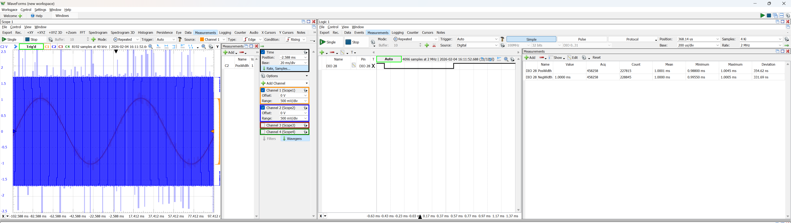
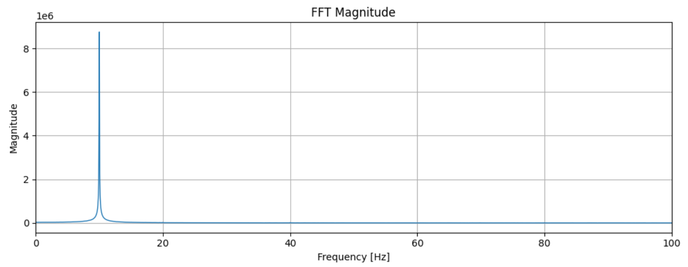

# Sensor Intelligence & Embedded Systems Lab

**Engineer:** Fausto Orozco Coy, MSc.
**Focus:** Firmware Engineering | DSP | RTOS | Mixed-Signal IC Drivers
**Status:** 🚀 Active Development (Week 3)

---

## 🎯 Portfolio Overview
This monorepo documents my transition from Academic Research to **Industrial Firmware Engineering**. It serves as a laboratory for mastering hard-tech concepts including deterministic sampling, Real-Time Operating Systems (FreeRTOS), and drivers for custom silicon.

### 🛠 Core Tech Stack
- **Languages:** C++ (Embedded), Python (Data Analysis), C (Drivers).
- **Platforms:** ESP32 (Xtensa), RISC-V, Custom SKY130 Silicon.
- **Tooling:** PlatformIO, Git Flow, Digilent WaveForms (Logic Analyzer/Scope).
- **Frameworks:** FreeRTOS, Pandas/SciPy (DSP), HAL Design.

---

## 🗂️ Engineering Modules (Projects)

### 1. ⚡ [Deterministic Data Acquisition Pipeline](./firmware/esp32-data-acquisition/)
**Objective:** Eliminate software jitter in signal processing.
- Implementation of **Hardware Timer Interrupts** (1kHz precise sampling).
- High-speed Serial Bridge (921kbps) to Python.
- **Validation:** Jitter measured at <5µs using Logic Analyzer. FFT spectral analysis.
- [👉 View Technical Documentation](./firmware/esp32-data-acquisition/)

### 2. 🔌 [OpAmpLab130: Custom Silicon Driver (HAL + CLI)](./firmware/opamplab-driver/)
**Objective:** Control interface for a custom Mixed-Signal ASIC.
- **Architecture:** Layered design (Hardware Abstraction Layer vs Application).
- **Protocol:** Bit-banged Shift Register driver for custom IC configuration.
- **Feature:** Interactive Command Line Interface (CLI) for real-time chip tuning.
- [👉 View Driver & Architecture](./firmware/opamplab-driver/)

### 3. 🚦 [RTOS & Concurrency Sandbox](./firmware/freertos-test/)
**Objective:** Mastering multitasking and resource protection.
- Implementation of **Tasks, Queues, and Mutexes** in FreeRTOS.
- Prevention of Race Conditions and Priority Inversion.
- Memory Management (Heap vs Stack) analysis.
- [👉 View Source Code](./firmware/freertos-test/)

---

## 📸 Lab Highlights
*Evidence of hardware-in-the-loop validation.*

| Jitter Analysis (Logic Analyzer) | Spectral Validation (Python DSP) |
| :---: | :---: |
|  |  |
| *Hardware Timer precision validation* | *10Hz Sine Wave Reconstruction* |

---

## 📬 Contact
Open to roles in **Firmware Engineering**, **Embedded Systems**, and **Application Engineering**.
[forozco@uniquindio.edu.co]